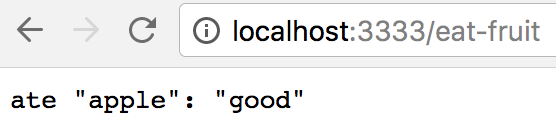
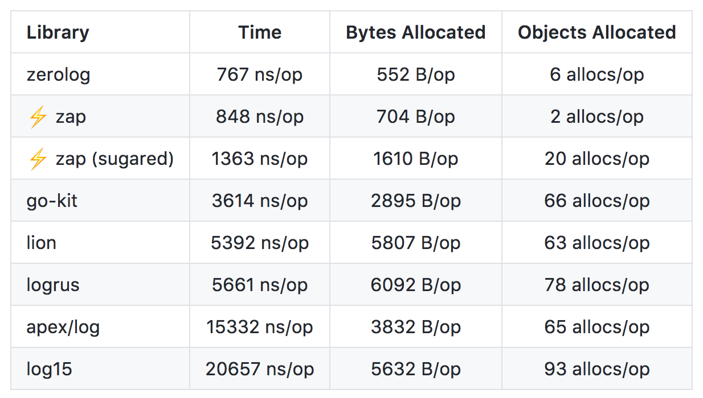
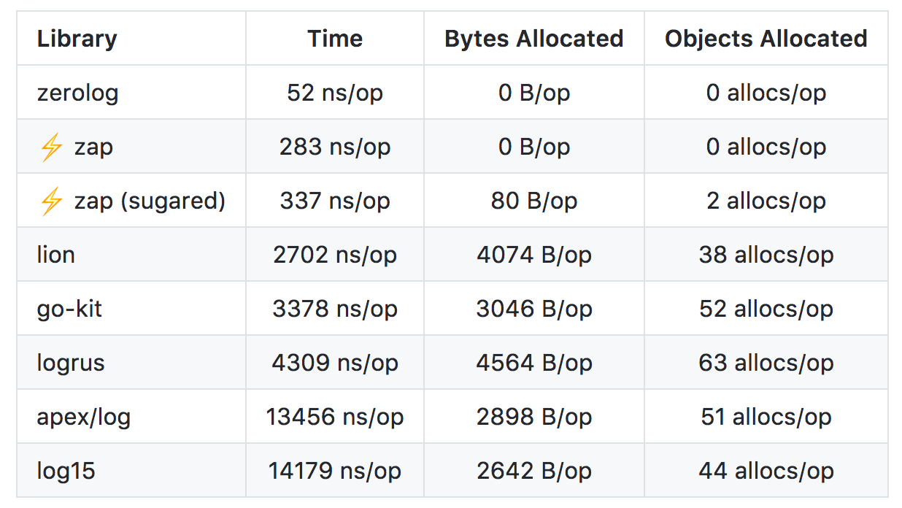
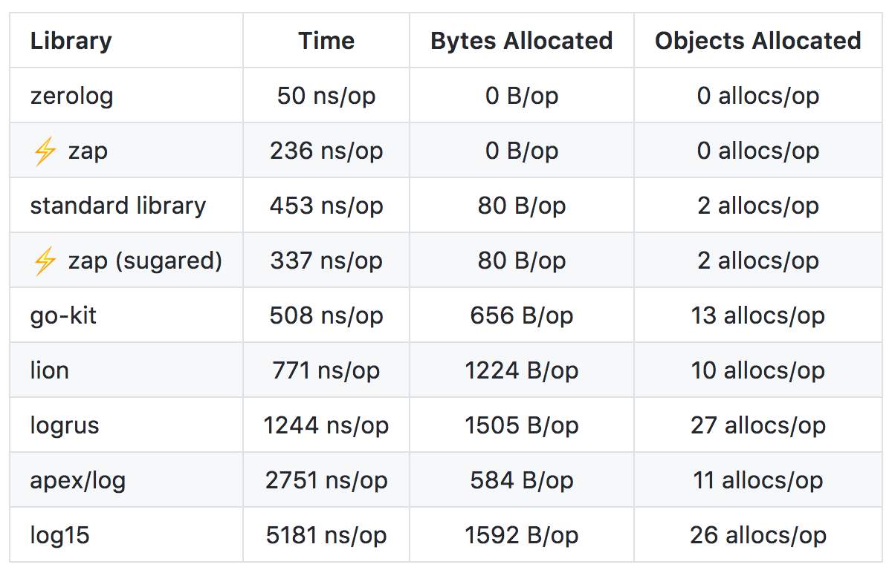
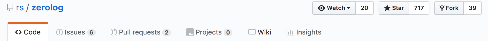
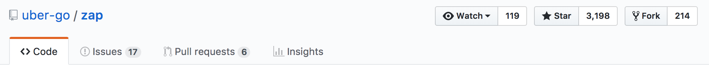

LOGGING
=======

Dmytro Kurkin

---

Best practices (Peter Bourgon):

- Log only actionable information, which will be read by a human or a machine
- Avoid fine-grained log levels — info and debug are probably enough
- Use structured logging
- Loggers are dependencies!

---

```Go
// Unstructured
log.Printf("HTTP server listening on %s", addr)

// Structured
logger.Log("transport", "HTTP", "addr", addr, "msg", "listening")
```

---

Simple server with a single endpoint

```Go
func main() {
	r := chi.NewRouter()
	r.Get("/eat-fruit", func(w http.ResponseWriter, r *http.Request) {
		fruit := fruits.ChooseRandom()
		result, err := fruits.Eat(fruit)
		if err != nil {
			w.Write([]byte(fmt.Sprintf(`failed eating "%s": "%s"`, fruit, err)))
			return
		}
		w.Write([]byte(fmt.Sprintf(`ate "%s": "%s"`, fruit, result)))
	})
	http.ListenAndServe(":3333", r)
}
```

---

It randomly chooses a fruit

```Go
func ChooseRandom() string {
	c, err := randutil.WeightedChoice([]randutil.Choice{
		{100, "apple"},
		{70, "banana"},
		{70, "pear"},
		{10, "coal"},
	})
	if err != nil {
		panic(err)
	}
	return c.Item.(string)
}
```

---

And "eats" it

```Go
func Eat(fruit string) (result string, err error) {
	switch fruit {
	case "apple":
		return "good", nil
	case "banana":
		return "nice", nil
	case "pear":
		return "alright", nil
	case "coal":
		return "", errors.New("can't eat coal")
	default:
		panic(fmt.Sprintf(`unknown fruit "%s"`, fruit))
	}
}
```

---



---

```Go
log.Print(`Choosing fruit to eat`)
fruit := fruits.ChooseRandom()

log.Printf(`Chose "%s"`, fruit)
result, err := fruits.Eat(fruit)

if err != nil {
	log.Printf(`Error eating: %v`, err)
	w.Write([]byte(fmt.Sprintf(`failed eating "%s": "%s"`, fruit, err)))
	return
}

log.Printf(`Yum, %s`, result)
	w.Write([]byte(fmt.Sprintf(`ate "%s": "%s"`, fruit, result)))
})
```

---

During the dev test everything seems to be OK

```log
2018/01/08 17:54:19 Choosing fruit to eat
2018/01/08 17:54:19 Chose "apple"
2018/01/08 17:54:19 Yum, good
2018/01/08 17:54:19 Choosing fruit to eat
2018/01/08 17:54:19 Chose "coal"
2018/01/08 17:54:19 Error eating: can't eat coal
2018/01/08 17:54:21 Choosing fruit to eat
2018/01/08 17:54:21 Chose "pear"
2018/01/08 17:54:21 Yum, alright
2018/01/08 17:54:21 Choosing fruit to eat
2018/01/08 17:54:21 Chose "pear"
2018/01/08 17:54:21 Yum, alright
```

---

Let's do the stress test!

```bash
$ echo "GET http://localhost:3333/eat-fruit" >target.txt
$ vegeta attack -duration=3s -rate=1000 -target=target.txt
```

---

When the server is under the load the logs are garbled

```log
2018/01/08 17:55:53 Choosing fruit to eat
2018/01/08 17:55:53 Chose "banana"
2018/01/08 17:55:53 Choosing fruit to eat
2018/01/08 17:55:53 Chose "apple"
2018/01/08 17:55:53 Yum, nice
2018/01/08 17:55:53 Yum, good
2018/01/08 17:55:53 Choosing fruit to eat
2018/01/08 17:55:53 Error eating: can't eat coal
2018/01/08 17:55:53 Yum, alright
2018/01/08 17:55:53 Choosing fruit to eat
2018/01/08 17:55:53 Chose "banana"
2018/01/08 17:55:53 Chose "pear"
2018/01/08 17:55:53 Yum, good
```

---

Fix? Pass the param to each log.Print call?

```Go
log.Print(`Choosing fruit to eat`)
fruit := fruits.ChooseRandom()

log.Printf(`Chose "%s"`, fruit)
result, err := fruits.Eat(fruit)

if err != nil {
	log.Printf(`Error eating "%s": %v`, err, fruit)
	w.Write([]byte(fmt.Sprintf(`failed eating "%s": "%s"`, fruit, err)))
	return
}

log.Printf(`Yum "%s", %s`, fruit, result)
	w.Write([]byte(fmt.Sprintf(`ate "%s": "%s"`, fruit, result)))
})
```

---

Still hard to follow!

```log
2018/01/08 18:57:35 Choosing fruit to eat
2018/01/08 18:57:35 Chose "apple"
2018/01/08 18:57:35 Yum "pear", alright
2018/01/08 18:57:35 Yum "banana", nice
2018/01/08 18:57:35 Yum "pear", alright
2018/01/08 18:57:35 Choosing fruit to eat
2018/01/08 18:57:35 Choosing fruit to eat
2018/01/08 18:57:35 Chose "apple"
2018/01/08 18:57:35 Choosing fruit to eat
2018/01/08 18:57:35 Error eating "coal": can't eat coal
2018/01/08 18:57:35 Choosing fruit to eat
2018/01/08 18:57:35 Yum "apple", good
```

---

Let's add a unique ID to indentify each request

```Go
r := chi.NewRouter()
r.Use(middleware.RequestID)
```

```Go
...
reqID := middleware.GetReqID(r.Context())

log.Printf(`%s: Choosing fruit to eat`, reqID)
fruit := fruits.ChooseRandom()

log.Printf(`%s: Chose "%s"`, reqID, fruit)
result, err := fruits.Eat(fruit)
...
```

---

It will look like so:

```log
2018/01/08 19:18:54 macbook482/H1XDd1tqhU-000009: Yum "apple", good
2018/01/08 19:18:54 macbook482/H1XDd1tqhU-000031: Choosing fruit to eat
2018/01/08 19:18:54 macbook482/H1XDd1tqhU-000004: Yum "pear", alright
2018/01/08 19:18:54 macbook482/H1XDd1tqhU-000017: Chose "apple"
2018/01/08 19:18:54 macbook482/H1XDd1tqhU-000032: Choosing fruit to eat
2018/01/08 19:18:54 macbook482/H1XDd1tqhU-000015: Chose "apple"
2018/01/08 19:18:54 macbook482/H1XDd1tqhU-000002: Yum "apple", good
2018/01/08 19:18:54 macbook482/H1XDd1tqhU-000011: Yum "banana", nice
2018/01/08 19:18:54 macbook482/H1XDd1tqhU-000033: Choosing fruit to eat
2018/01/08 19:18:54 macbook482/H1XDd1tqhU-000021: Chose "banana"
```

---

We can filter each request:

```bash
$ grep H1XDd1tqhU-000010 server.log
2018/01/08 19:18:54 macbook482/H1XDd1tqhU-000010: Choosing fruit to eat
2018/01/08 19:18:54 macbook482/H1XDd1tqhU-000010: Chose "banana"
2018/01/08 19:18:54 macbook482/H1XDd1tqhU-000010: Yum "banana", nice
```

---

We're left with a problem!

```Go
log.Printf("...", reqID, param1, param2, ...)
...
log.Printf("...", reqID, param1, param2, ...)
...
log.Printf("...", reqID, param1, param2, ...)
...
log.Printf("...", reqID, param1, param2, ...)
```

---

```Go
import (
    "github.com/rs/zerolog"
    "github.com/rs/zerolog/log"
)
```
```Go
log.Logger = log.Output(zerolog.ConsoleWriter{Out: os.Stderr})
```
```Go
reqID := middleware.GetReqID(r.Context())
log := log.With().Str("reqID", reqID).Logger()
log.Print("Choosing fruit to eat")
fruit := fruits.ChooseRandom()

log = log.With().Str("fruit", fruit).Logger()
log.Print("chosen")
result, err := fruits.Eat(fruit)

if err != nil {
    log.Printf(`Error eating: %v`, err)
    w.Write([]byte(fmt.Sprintf(`failed eating "%s": "%s"`, fruit, err)))
    return
}

log.Printf(`Yum %s`, result)
```

---

```log
2018-01-08T19:50:24+02:00 |DEBU| Choosing fruit to eat reqID=macbook482/OPVw9zInFL-002999
2018-01-08T19:50:24+02:00 |DEBU| chosen fruit=banana reqID=macbook482/OPVw9zInFL-002987
2018-01-08T19:50:24+02:00 |DEBU| chosen fruit=apple reqID=macbook482/OPVw9zInFL-002980
2018-01-08T19:50:24+02:00 |DEBU| Choosing fruit to eat reqID=macbook482/OPVw9zInFL-003000
2018-01-08T19:50:24+02:00 |DEBU| chosen fruit=banana reqID=macbook482/OPVw9zInFL-002985
2018-01-08T19:50:24+02:00 |DEBU| chosen fruit=banana reqID=macbook482/OPVw9zInFL-002984
2018-01-08T19:50:24+02:00 |DEBU| Yum alright fruit=pear reqID=macbook482/OPVw9zInFL-002969
2018-01-08T19:50:24+02:00 |DEBU| Yum good fruit=apple reqID=macbook482/OPVw9zInFL-002970
2018-01-08T19:50:24+02:00 |DEBU| Yum good fruit=apple reqID=macbook482/OPVw9zInFL-002971
2018-01-08T19:50:24+02:00 |DEBU| chosen fruit=pear reqID=macbook482/OPVw9zInFL-002988
2018-01-08T19:50:24+02:00 |DEBU| chosen fruit=banana reqID=macbook482/OPVw9zInFL-002989
2018-01-08T19:50:24+02:00 |DEBU| chosen fruit=apple reqID=macbook482/OPVw9zInFL-002990
2018-01-08T19:50:24+02:00 |DEBU| Error eating: can't eat coal fruit=coal reqID=macbook482/OPVw9zInFL-002979
```

---

Loggers are dependencies

---

- limit logging library usage to one layer
- wrap errors and bubble them up the call stack to provide context

---


---

```Go
import "github.com/pkg/errors"
```

```Go
func Download(url string) ([]byte, error) {
	r, err := http.Get(url)
	if err != nil {
		return nil, errors.Wrapf(err, "get url: %s", url)
	}
	defer r.Body.Close()
	body, err := ioutil.ReadAll(r.Body)
	if err != nil {
		return nil, errors.Wrap(err, "writing file")
	}
	return body, nil
}
```

---

```Go
func main() {
	data, err := Download("https://non-existent-url")
	if err != nil {
		log.Printf("%+v", err)
		return
	}
	fmt.Println(data)
}
```

---

```log
2018/01/09 16:27:31 Get https://non-existent-url: dial tcp: lookup non-existent-url: no such host
get url: https://non-existent-url
main.Download
	/Users/dkurk/github/go-logging/go/src/talk/wrap/main.go:15
main.main
	/Users/dkurk/github/go-logging/go/src/talk/wrap/main.go:28
runtime.main
	/usr/local/Cellar/go/1.9.2/libexec/src/runtime/proc.go:195
runtime.goexit
	/usr/local/Cellar/go/1.9.2/libexec/src/runtime/asm_amd64.s:2337
```

---

Next step? JSON logs!

```JSON
{"time":"2018-01-09T14:41:50+02:00","level":"debug","reqID":"macbook482/bjdStJS0Ug-000001","message":"Choosing fruit to eat"}
{"time":"2018-01-09T14:41:50+02:00","level":"debug","reqID":"macbook482/bjdStJS0Ug-000001","fruit":"banana","message":"chosen"}
{"time":"2018-01-09T14:41:50+02:00","level":"debug","reqID":"macbook482/bjdStJS0Ug-000001","fruit":"banana","message":"Yum nice"}
{"time":"2018-01-09T14:42:06+02:00","level":"debug","reqID":"macbook482/bjdStJS0Ug-000002","message":"Choosing fruit to eat"}
{"time":"2018-01-09T14:42:06+02:00","level":"debug","reqID":"macbook482/bjdStJS0Ug-000002","fruit":"apple","message":"chosen"}
{"time":"2018-01-09T14:42:06+02:00","level":"debug","reqID":"macbook482/bjdStJS0Ug-000002","fruit":"apple","message":"Yum good"}
```

---

Why ?

- easy to load to 3rd party solution like Loggly, Splunk, etc.
- can be used for advanced shell filtering using tools like JQ

---

Splunk:


---

Loggly:


---

Which library to choose?

---

APIs
====

---

Zerolog:

```Go
sublogger := log.With().Str("param1", "value1").Logger()
sublogger.Info().Str("param2", "value2").Msg("hello world")
```

```JSON
{"time":"2018-01-09T15:08:11+02:00","level":"info","param1":"value1","param2":"value2","message":"hello world"}
```

---

Uber Zap:

```Go
logger, _ := zap.NewProduction()
sublogger := logger.With(zap.String("param1", "value1"))
sublogger.Info("hello world", zap.String("param2", "value2"))
```

```JSON
{"level":"info","ts":1515503226.6880667,"caller":"apis/main.go:10","msg":"hello world","param1":"value1","param2":"value2"}
```

---

Logrus:

```Go
sublogger := logrus.WithFields(logrus.Fields{"param1": "value1"})
sublogger.WithField("param2", "value2").Info("hello world")
```

```JSON
{"level":"info","msg":"hello world","param1":"value1","param2":"value2","time":"2018-01-09T15:15:06+02:00"}
```

---

- API differences are minimal
- Preferences are subjective

---

Benchmarks
==========

---

Log a message and 10 fields:



---

Log a message with a logger that already has 10 fields of context:



---

Log a static string, without any context or printf-style templating:



---

Take them with a grain of salt

---

GitHub stats
============

---



---




---


---

Thank you
=========

---

Questions?

---

Logging in Python
=================

---

Principles

- Easy to reconfigure (DRY principle)
- Easy to read & navigate

---

Loggers are hierarchical:


---

```bash
$ ls
child1.py	child2.py	main.py
```

---

main.py:

```Python
import logging

logging.basicConfig()
root_logger = logging.getLogger()
root_logger.setLevel(logging.DEBUG)

import child1
import child2
```

---

child1.py:

```Python
import logging

LOG = logging.getLogger(__name__)

LOG.debug('hello debug')
LOG.info('hello info')
LOG.warning('hello warning')
LOG.error('hello error')
```

---

child2.py:

```Python
import logging

LOG = logging.getLogger(__name__)

LOG.debug('hello debug')
LOG.info('hello info')
LOG.warning('hello warning')
LOG.error('hello error')
```

---

```bash
$ python main.py
DEBUG:child1:hello debug
INFO:child1:hello info
WARNING:child1:hello warning
ERROR:child1:hello error
DEBUG:child2:hello debug
INFO:child2:hello info
WARNING:child2:hello warning
ERROR:child2:hello error
```

---

main.py:
```Python
root_logger.setLevel(logging.WARNING)
```

output:

```bash
$ python main.py
WARNING:child1:hello warning
ERROR:child1:hello error
WARNING:child2:hello warning
ERROR:child2:hello error
```

---

main.py:
```Python
logging.getLogger('child2').setLevel(logging.WARNING)
```

output:

```bash
$ python main.py
DEBUG:child1:hello debug
INFO:child1:hello info
WARNING:child1:hello warning
ERROR:child1:hello error
WARNING:child2:hello warning
ERROR:child2:hello error
```

---


---


---

Was used:

```Python
logging.info('I am using root logger')
```

Which is equal to:

```Python
root_logger = logging.getLogger()
root_logger.info('I am using root logger')
```

Should've used:

```Python
LOG = logging.getLogger(__name__)
LOG.info('I am using my logger')
```

---

Hard to reconfigure!

---

Was used:

```Python
logging.info('setting user permissions')
```

Should've used:

```Python
LOG.info('[requestID=%s] [sessionID=%s] setting user permissions' % (requestID, sessionID))
```

---

Hard to read & navigate!
